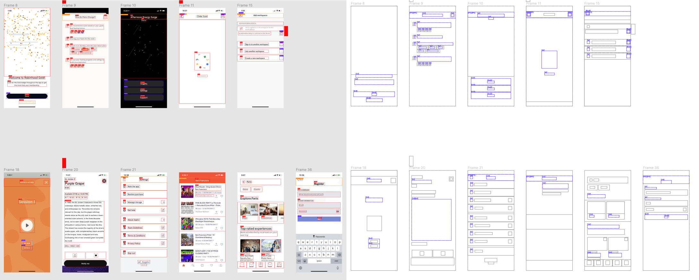

# ui-labeller (plugin for figma / sketch)

label your image dataset on figma for realtime collaboration and data centralization

> there is powerful tool called figma. why use other tools just for data labelling?

## Installation
figma - read [this guide](./figma/README.md)

## Design
openned design file for ui-labeller available at [figma](https://www.figma.com/file/U0gKxMTiLgk6uB08qeTzoa/ui-labeller-plugin?node-id=0%3A1)

## Features
- Load you data from S3 / GCP
    - Organize workspace (Makes Artboards for your loaded images, and make them as a user-friendly grid)
- Make your own labelling preferences
- Box / Ellipse / Custom shape labellings are supported
- Multi tag in single label is supported

## Example

## Why to use Bridged's Labeller instead of other labelling tools?
- It's Live - Best collaboration experience.
- It's Visual - You can see your work in one place. (You don't get lost. You know where you are.)
- It's easy to edit your labels preferense.
- It's easy to share
- It's all Open and Free
- Add comments right above your design.
- It just makes sense when your data is ui design.

## How to use

*Example usage - [here](https://www.figma.com/file/01QCgPwNc7DLqmgNvVgJaF/?node-id=37%3A0)*

1. Make @labels page and make your labels as Components.
2. Make any page to load your dataset.
3. Load your data via providing S3 credentials, and wait for it to sync.
4. Label it via the plugin interface!
5. Download or sync the labelled data set.
6. Make awesome models.

## Contribution
[contributing guideline](https://github.com/bridgedxyz/contributing-and-license)
